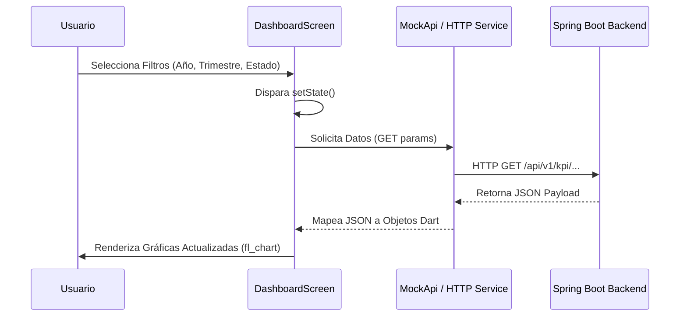
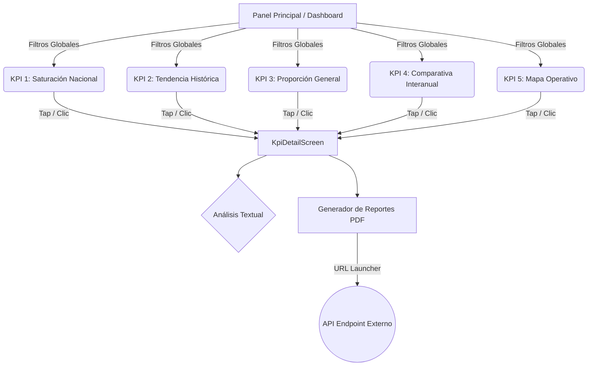

# Sistema de Inteligencia y Soporte a Decisiones para Emergencias Nacionales

[](https://flutter.dev/)
[](https://dart.dev/)
[](https://spring.io/projects/spring-boot/)
[](https://restfulapi.net/)
[](https://www.tecnm.mx/)
[](LICENSE)

## Equipo de Desarrollo:

Este proyecto es el resultado del trabajo conjunto del equipo de desarrollo, compuesto por especialistas en frontend y backend.

| Integrante | Matrícula | Rol Principal |
| :--- | :--- | :--- |
| **MARTÍNEZ MENDOZA JESÚS ÁNGEL** | 22161152 | Frontend Lead / Arquitectura |
| **DIEGO GARCIA JENNIFER** | 22161050 | Frontend Developer / UI-UX |
| **ELORZA PÉREZ JOAQUÍN BARUC** | 22161052 | Frontend Developer / Integración |
| **CANDELARIA VELAZQUEZ RODRIGO** | 22161014 | Backend Developer / Base de Datos |
| **GARCÍA GALLEGOS ERIC** | 22161068 | Backend Developer / API REST |
| **HERNANDEZ SORIANO MANUEL** | 22161097 | Backend Lead / Arquitectura |

---

## Definición del Sistema
El Sistema de Soporte a Decisiones (DSS) es una plataforma de Inteligencia de Negocios diseñada para procesar, consolidar y visualizar datos masivos de incidencias delictivas y emergencias viales a nivel nacional. Su objetivo principal es transformar información cruda en inteligencia operativa accionable mediante procesos ETL y el análisis de Indicadores Clave de Rendimiento (KPIs). Esta herramienta proporciona a los altos mandos y centros de monitoreo una interfaz gerencial para identificar patrones geoespaciales y temporales, permitiendo optimizar la asignación de recursos, reducir tiempos de respuesta y formular estrategias tácticas basadas en evidencia algorítmica y matemática.

> **Nota de Navegación:** Este es el repositorio de **Frontend**. Para ver la otra mitad del sistema, visita el [Repositorio de Backend](https://github.com/ManuHernandezDev/backend-emergencias-api).

---

## Documentación Técnica: Arquitectura Frontend

El cliente de visualización fue desarrollado utilizando **Flutter** y **Dart**, garantizando un rendimiento nativo y una compilación multiplataforma. La arquitectura sigue principios de desacoplamiento, separando la lógica de consumo de servicios web de la capa de presentación (Widgets).

### Stack Tecnológico
* **Framework:** Flutter 3.x
* **Lenguaje:** Dart 3.0+
* **Renderizado de Datos:** `fl_chart` (Gráficas matemáticas interactivas 2D).
* **Consumo REST:** `http` (Peticiones asíncronas).
* **Gestión de Reportes:** `url_launcher` (Delegación de descarga de binarios PDF al sistema operativo).

### Diagrama de Flujo de Datos (Data Flow)
El siguiente diagrama ilustra el ciclo de vida de una petición desde la interacción del usuario hasta la renderización de los KPIs interactivos.



### Arquitectura de Navegación (Drill-Down)

El sistema está diseñado bajo el patrón *Drill-Down*, donde las gráficas iniciales actúan como resúmenes ejecutivos que, al ser accionados, despliegan análisis profundos y opciones de exportación documental.



---

## Contratos de Integración (Frontend a Backend)

Para garantizar la interoperabilidad del sistema, el frontend concatena automáticamente el estado de la UI en la URL de las peticiones HTTP.

### Parámetros Estándar

Cada petición enviada a la API incluye los siguientes parámetros dinámicos:

* `estado`: Cadena de texto (Ej. "Nacional", "Jalisco").
* `anio`: Cadena de texto (Ej. "2024").
* `trimestre`: Cadena de texto (Ej. "Todos", "T1").

### Endpoints Consumidos

La capa de servicios en `lib/services/mock_api.dart` está estructurada para consumir las siguientes rutas base:

1. `GET /api/v1/kpi/saturacion`
2. `GET /api/v1/kpi/tendencia`
3. `GET /api/v1/kpi/proporcion`
4. `GET /api/v1/kpi/comparativa`
5. `GET /api/v1/kpi/dias-criticos`

---

## Guía de Configuración Local

Para compilar y ejecutar este proyecto en un entorno de desarrollo local (Linux, macOS, o Windows), siga estos pasos:

1. **Clonación del Repositorio:**
```bash
git clone [https://github.com/jangelmm/frontend-emergencias-app.git](https://github.com/jangelmm/frontend-emergencias-app.git)
cd frontend-emergencias-app

```


2. **Resolución de Dependencias:**
```bash
flutter pub get

```


3. **Ejecución en Entorno de Escritorio (Recomendado para desarrollo ágil):**
```bash
flutter run -d linux

```


> **Nota para Desarrolladores:** El proyecto actualmente contiene una arquitectura lista para la integración. Para cambiar del modo "Mock" al modo "Producción", modifiquen las funciones dentro de `lib/services/mock_api.dart` implementando el paquete `http` hacia la dirección del servidor Spring Boot.
